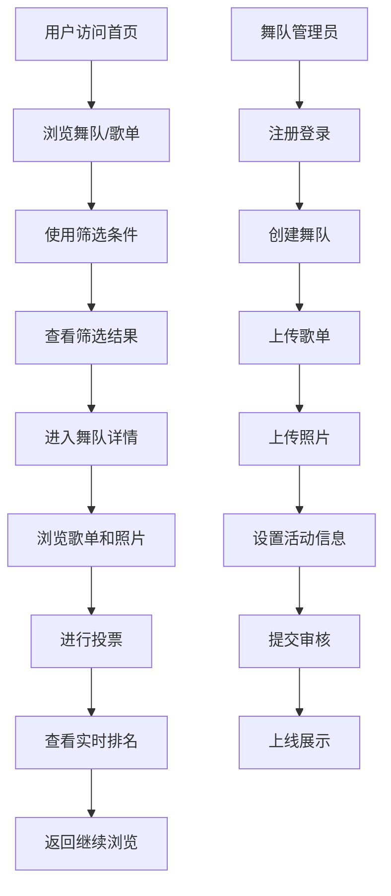

## 1. 产品概述

广场舞金曲歌单PK与舞队风采展示平台，为各广场舞团队提供展示空间，支持歌单上传、风采展示、互动投票等功能。平台面向广场舞爱好者，通过歌单PK和风采展示增强社区互动，挖掘优秀广场舞队伍和曲目。

- 核心价值：连接广场舞团队，促进文化交流，打造广场舞社区生态
- 目标用户：广场舞团队成员、广场舞爱好者、社区文化工作者

## 2. 核心功能

### 2.1 用户角色

| 角色 | 注册方式 | 核心权限 |
|------|---------|---------|
| 游客 | 无需注册 | 浏览舞队信息、歌单、排行榜、地图 |
| 舞队管理员 | 手机号注册 | 创建/编辑舞队信息、上传歌单和照片、管理投票 |
| 普通用户 | 手机号注册 | 为歌单投票、为服装创意度投票、收藏舞队 |

### 2.2 功能模块

1. **首页**：舞队推荐、热门歌单PK、最新活动、快速筛选
2. **舞队展示**：舞队列表、详情页、风采照片、歌单展示
3. **歌单PK**：歌单投票对比、上头程度评分、排行榜
4. **地图分布**：公园舞队分布、活动时段标注、区域筛选
5. **舞队管理**：舞队信息编辑、歌单上传、照片管理
6. **排行榜**：综合排行榜、歌单榜、服装创意榜

### 2.3 页面详情

| 页面名称 | 模块名称 | 功能描述 |
|---------|---------|---------|
| 首页 | 导航栏 | Logo、搜索、分类筛选、登录/注册入口 |
| 首页 | 英雄区 | 精选舞队轮播、主题宣传语 |
| 首页 | 热门PK区 | 两组歌单对比投票、上头程度实时显示 |
| 首页 | 热门舞队 | 卡片式展示、基本信息和评分 |
| 首页 | 筛选面板 | 按区域、曲风、人数规模筛选 |
| 舞队列表页 | 筛选栏 | 多维度筛选和排序 |
| 舞队列表页 | 舞队卡片 | 头像、名称、区域、人数、评分 |
| 舞队详情页 | 基本信息 | 名称、队长、成立时间、人数规模 |
| 舞队详情页 | 活动信息 | 活动公园、固定时段、地图定位 |
| 舞队详情页 | 风采展示 | 合影照片、服装照片轮播 |
| 舞队详情页 | 歌单展示 | 曲目列表、上头程度评分、投票按钮 |
| 舞队详情页 | 服装评分 | 创意度评分、投票按钮 |
| 歌单PK页 | 对战区 | 两个歌单对比展示、投票操作 |
| 歌单PK页 | 排行榜 | 总榜、周榜、月榜 |
| 地图页 | 地图展示 | 公园标记、舞队分布热力图 |
| 地图页 | 侧边栏 | 筛选条件、舞队列表 |
| 排行榜页 | 排行榜单 | 综合排名、分类排名 |
| 管理中心 | 舞队信息 | 编辑舞队基本信息 |
| 管理中心 | 歌单管理 | 添加/编辑/删除歌单曲目 |
| 管理中心 | 照片管理 | 上传/删除合影和服装照片 |

## 3. 核心流程

### 3.1 舞队入驻流程
舞队管理员注册 → 创建舞队档案 → 填写基本信息 → 上传歌单 → 上传照片 → 设置活动信息 → 提交审核 → 展示上线

### 3.2 用户投票流程
浏览歌单/服装 → 选择喜欢的歌单/服装 → 点击投票按钮 → 投票成功 → 查看实时排名

### 3.3 筛选查找流程
进入首页/列表页 → 选择筛选条件（区域/曲风/人数） → 查看筛选结果 → 点击进入详情页

## 4. 界面设计

### 4.1 设计风格
- 主色调：热情红（#E63946）搭配活力橙（#F4A261），体现广场舞的活力和热情
- 辅助色：天空蓝（#457B9D）用于地图和信息展示
- 中性色：米白背景、深灰文字，保证可读性
- 按钮风格：圆角大按钮，渐变色彩，悬停有缩放动效
- 字体：展示字体用"ZCOOL KuaiLe"（站酷快乐体）富有活力，正文字体用"Noto Sans SC"清晰易读
- 布局风格：卡片式布局、大留白、视觉层次感强
- 图标风格：emoji风格图标，如💃、🎵、🏆、📍等

### 4.2 页面设计概览

| 页面名称 | 模块名称 | UI元素 |
|---------|---------|--------|
| 首页 | 英雄区 | 渐变背景、大标题、轮播舞队卡片、入场动画 |
| 首页 | 热门PK区 | VS对决布局、双歌单卡片、投票进度条、心跳动效 |
| 首页 | 舞队卡片 | 3D悬停效果、评分星标、彩色标签 |
| 舞队详情页 | 照片墙 | 瀑布流布局、灯箱效果、图片渐变边框 |
| 歌单PK页 | 对战区 | 分屏设计、进度条动画、投票按钮脉冲效果 |
| 地图页 | 地图区域 | 动态标记点、弹跳动画、弹窗信息卡 |
| 排行榜页 | 排名列表 | 金银铜牌样式、进度条、入场错开动画 |

### 4.3 响应式设计
- 采用桌面优先设计，适配移动端
- 导航栏在移动端转为汉堡菜单
- 卡片布局在小屏转为单列
- 地图组件支持触摸缩放
- 按钮和交互元素确保触摸友好

### 4.4 动效设计
- 页面加载：元素从下往上淡入，错开延迟
- 悬停效果：卡片轻微上浮、阴影加深、缩放1.02倍
- 投票动效：点击后出现爱心飘散动画，数字递增动画
- 排行榜更新：滚动时渐入，排名变化有滑入滑出
- 地图标记：点击时有弹跳效果，信息卡滑出
