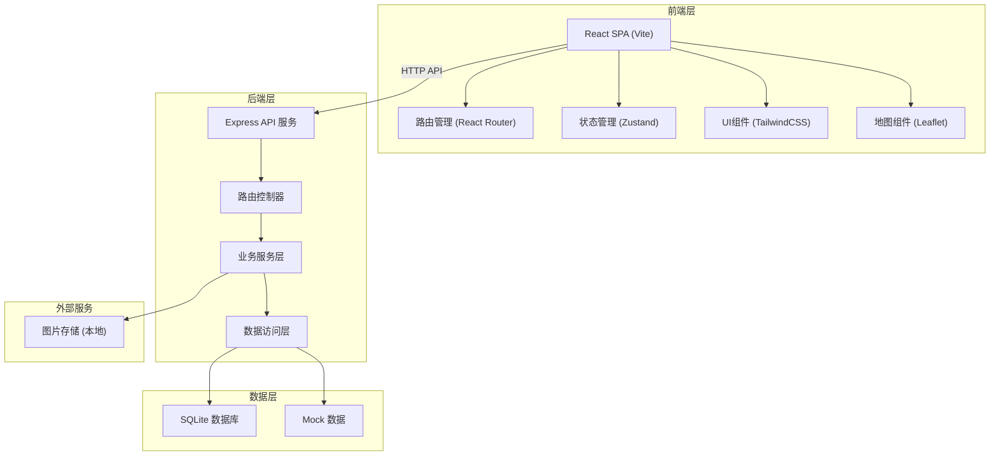
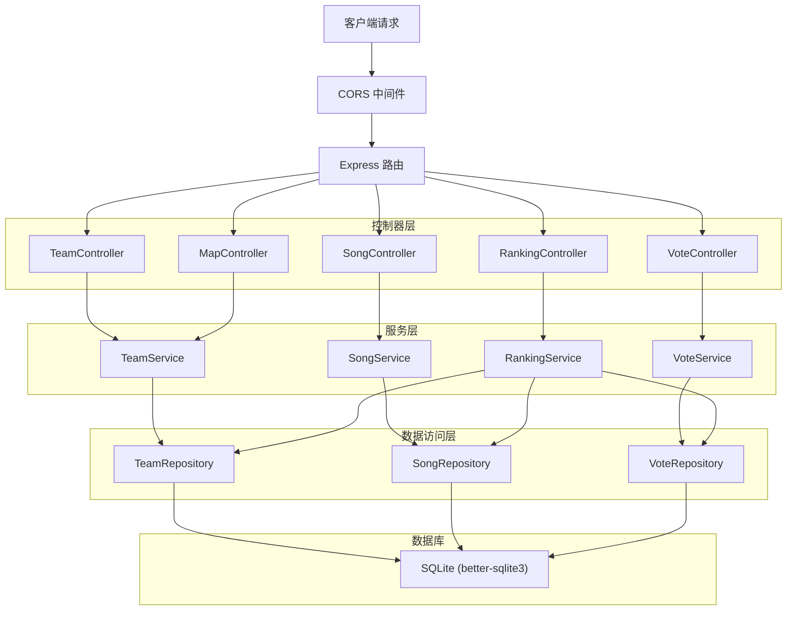
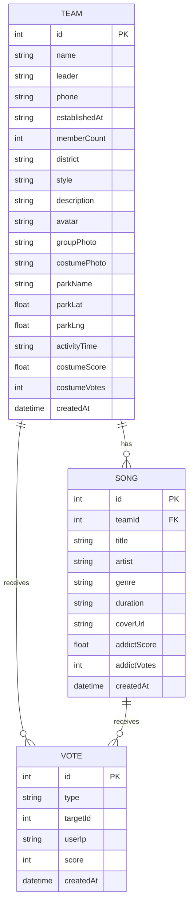

## 1. 架构设计



## 2. 技术描述

- **前端**: React@18 + TypeScript + Vite + TailwindCSS@3 + Zustand + React Router DOM + Lucide React
- **后端**: Express@4 + TypeScript + CORS + Multer (文件上传)
- **数据库**: SQLite (better-sqlite3) + 内存数据库 + Mock数据初始化
- **地图**: Leaflet + OpenStreetMap
- **初始化工具**: vite-init
- **包管理器**: npm

## 3. 路由定义

| 路由路径 | 页面组件 | 功能描述 |
|---------|---------|---------|
| / | HomePage | 首页：推荐舞队、热门PK、筛选 |
| /teams | TeamListPage | 舞队列表：多维度筛选、排序 |
| /teams/:id | TeamDetailPage | 舞队详情：信息、照片、歌单、投票 |
| /battle | BattlePage | 歌单PK：双歌单对比投票 |
| /map | MapPage | 地图分布：公园舞队分布 |
| /ranking | RankingPage | 排行榜：综合、歌单、服装 |
| /admin | AdminPage | 管理中心：舞队信息、歌单、照片管理 |

## 4. API 定义

### 4.1 类型定义

```typescript
// 共享类型定义
interface Team {
  id: number;
  name: string;
  leader: string;
  phone: string;
  establishedAt: string;
  memberCount: number;
  district: string;
  style: string;
  description: string;
  avatar: string;
  groupPhoto: string;
  costumePhoto: string;
  parkName: string;
  parkLat: number;
  parkLng: number;
  activityTime: string;
  costumeScore: number;
  costumeVotes: number;
  createdAt: string;
}

interface Song {
  id: number;
  teamId: number;
  title: string;
  artist: string;
  genre: string;
  duration: string;
  coverUrl: string;
  addictScore: number;
  addictVotes: number;
  createdAt: string;
}

interface VoteRecord {
  id: number;
  type: 'addict' | 'costume';
  targetId: number;
  userIp: string;
  score: number;
  createdAt: string;
}
```

### 4.2 API 接口

| 方法 | 路径 | 功能 | 请求参数 | 响应 |
|-----|------|------|---------|------|
| GET | /api/teams | 获取舞队列表 | district?, style?, memberCount?, page?, pageSize? | { teams: Team[], total: number } |
| GET | /api/teams/:id | 获取舞队详情 | - | Team |
| POST | /api/teams | 创建舞队 | FormData: name, leader, phone, establishedAt, memberCount, district, style, description, avatar, groupPhoto, costumePhoto, parkName, parkLat, parkLng, activityTime | Team |
| PUT | /api/teams/:id | 更新舞队 | 同创建 | Team |
| GET | /api/teams/:id/songs | 获取舞队歌单 | - | Song[] |
| POST | /api/teams/:id/songs | 添加歌曲 | title, artist, genre, duration, coverUrl? | Song |
| DELETE | /api/songs/:id | 删除歌曲 | - | { success: boolean } |
| POST | /api/votes/addict | 歌单上头程度投票 | songId, score, userIp | { success: boolean, newScore: number, totalVotes: number } |
| POST | /api/votes/costume | 服装创意度投票 | teamId, score, userIp | { success: boolean, newScore: number, totalVotes: number } |
| GET | /api/ranking/comprehensive | 综合排行榜 | limit? | Team[] |
| GET | /api/ranking/addict | 歌单排行榜 | limit? | Song[] |
| GET | /api/ranking/costume | 服装排行榜 | limit? | Team[] |
| GET | /api/map/teams | 地图舞队分布 | district? | Team[] |
| GET | /api/battle/pair | 获取PK歌单对 | - | { song1: Song, song2: Song, team1: Team, team2: Team } |

## 5. 服务器架构图



## 6. 数据模型

### 6.1 ER 图



### 6.2 DDL 语句

```sql
-- 舞队表
CREATE TABLE IF NOT EXISTS teams (
  id INTEGER PRIMARY KEY AUTOINCREMENT,
  name VARCHAR(100) NOT NULL,
  leader VARCHAR(50) NOT NULL,
  phone VARCHAR(20) NOT NULL,
  establishedAt DATE NOT NULL,
  memberCount INTEGER NOT NULL DEFAULT 10,
  district VARCHAR(50) NOT NULL,
  style VARCHAR(50) NOT NULL,
  description TEXT,
  avatar VARCHAR(255),
  groupPhoto VARCHAR(255),
  costumePhoto VARCHAR(255),
  parkName VARCHAR(100) NOT NULL,
  parkLat DECIMAL(10, 6) NOT NULL,
  parkLng DECIMAL(10, 6) NOT NULL,
  activityTime VARCHAR(100) NOT NULL,
  costumeScore DECIMAL(3, 2) DEFAULT 0,
  costumeVotes INTEGER DEFAULT 0,
  createdAt DATETIME DEFAULT CURRENT_TIMESTAMP
);

-- 歌单表
CREATE TABLE IF NOT EXISTS songs (
  id INTEGER PRIMARY KEY AUTOINCREMENT,
  teamId INTEGER NOT NULL,
  title VARCHAR(100) NOT NULL,
  artist VARCHAR(100) NOT NULL,
  genre VARCHAR(50) NOT NULL,
  duration VARCHAR(20),
  coverUrl VARCHAR(255),
  addictScore DECIMAL(3, 2) DEFAULT 0,
  addictVotes INTEGER DEFAULT 0,
  createdAt DATETIME DEFAULT CURRENT_TIMESTAMP,
  FOREIGN KEY (teamId) REFERENCES teams(id) ON DELETE CASCADE
);

-- 投票记录表
CREATE TABLE IF NOT EXISTS votes (
  id INTEGER PRIMARY KEY AUTOINCREMENT,
  type VARCHAR(20) NOT NULL,
  targetId INTEGER NOT NULL,
  userIp VARCHAR(50) NOT NULL,
  score INTEGER NOT NULL CHECK(score BETWEEN 1 AND 5),
  createdAt DATETIME DEFAULT CURRENT_TIMESTAMP
);

-- 索引
CREATE INDEX IF NOT EXISTS idx_teams_district ON teams(district);
CREATE INDEX IF NOT EXISTS idx_teams_style ON teams(style);
CREATE INDEX IF NOT EXISTS idx_teams_memberCount ON teams(memberCount);
CREATE INDEX IF NOT EXISTS idx_songs_teamId ON songs(teamId);
CREATE INDEX IF NOT EXISTS idx_songs_genre ON songs(genre);
CREATE INDEX IF NOT EXISTS idx_votes_type_target ON votes(type, targetId);
CREATE INDEX IF NOT EXISTS idx_votes_userIp ON votes(userIp);
```

### 6.3 初始化 Mock 数据

初始化10支舞队数据，每支舞队包含3-5首歌曲，覆盖不同区域、曲风、人数规模。包括：
- 东城区、西城区、朝阳区、海淀区、丰台区 等区域
- 民族风、流行风、爵士风、古典风、健身操 等曲风
- 10人以下、10-30人、30-50人、50人以上 等规模
- 预设公园坐标（基于北京市区公园）
- 预置投票分数（1-5星）
